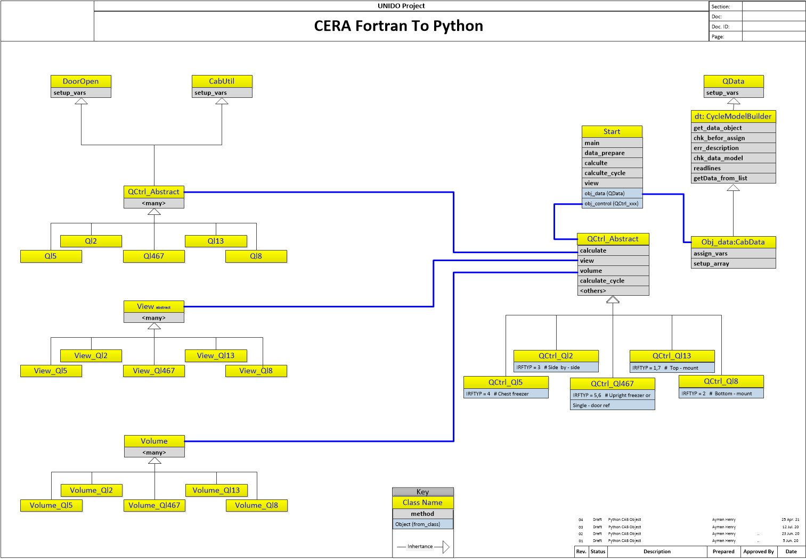
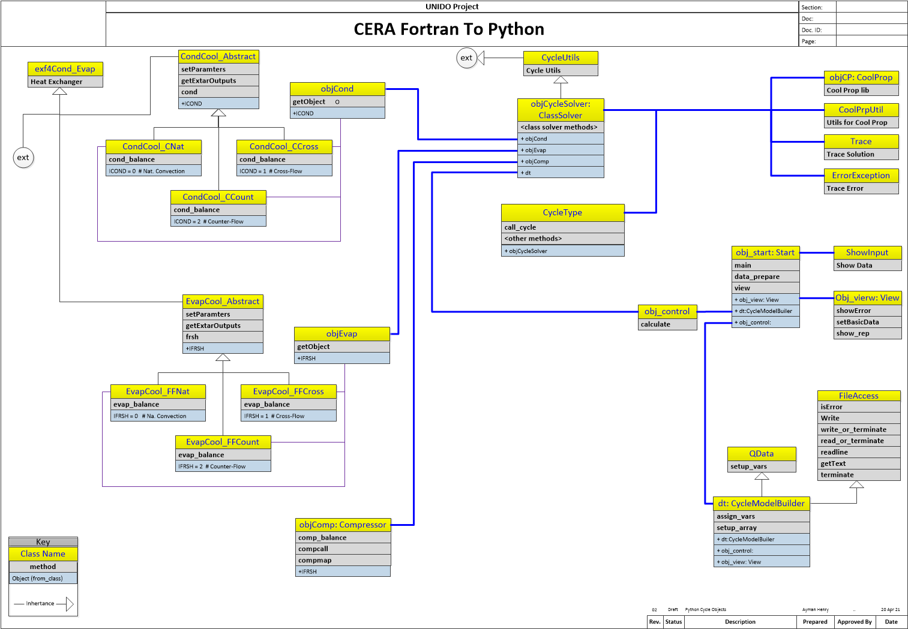

# Python_CERA

[TOC]

## General information

### **Introduction**

​	This project man target is to translate an old Fortran77 application, to a new Python language. OOP technology need to be used in the final project output. Source code for Fortran77  is included in this application documents, folder **([Source code for Fortran77](https://github.com/aymhenry/Python_CERA-under-development/tree/master/Fortran77_Source))**. 

### **Project target**

1. Convert an application, from old Fortran77 to Python.
2. Translate the source-code language of CERA from Fortran to Python. This should include testing and verification of the translation to ensure that source code operates effectively under the new version.
   Deliverable: A source code of CERA converted to python 
3. Improve and change the source-code architecture to Object-Oriented Programing
   Deliverable: A source code converted to an object-oriented programming
4. Develop a simplified text input interface using simplified text editors or Microsoft Excel and a simplified output format using a comma- or tab-delimited format that can be read in
   different tools (text editors or Microsoft Excel)
   Deliverable: The text input and output interfaces using simplified text editors or Microsoft Excel completed

Cycle Solver is a solver in Python for refrigerator cycle. it contains a group of class as shown in graph:

### **Philosophy**

​	To make the output of Python application debug is more simple, the main function names and variable name will be the same in Python application. It is not normal to use caps for variable names in Python, but we used caps variables name, to be similar as the Fortran source. Methods name was set in small letters, but the same as function names in Fortran.

​	[CoolProb]( http://www.coolprop.org/Utility ) utility is used as an alternative to Fortran library which do the same task.

​	Some other Python classes was created as an alternative to old dos function, for example Python [FileAcccess](https://github.com/aymhenry/Python_CERA-under-development/blob/master/App/common_classes/FileAccess.py) class.

​	Fortran source has some issue, that was clear after transfer application to Python :-

- Some variables is not used

- Some calculated values is not used nor printed in reports.

   

### Basic design of Python

​	The application is divided into two  main parts, namely Cab and Cycle application. Each has its own OOP structure, and inputs and outputs. Some class is used in both application (see [/common_classes](/common_classes))

##### 	Cab application (save in App/cab_classes)

​	Analyses of the cabinet loads. The steady-state heat inputs to the cabinet section are determined for various configuration refrigerator/freezers, alternative insulation system designs, and specified environment and usage conditions.

| Cab Application OOP structure |
| :---------------------------: |
|                               |


##### 	Cycle Application (save in App/cycle_classes)

​	Determination of the steady-state, instantaneous, refrigeration cycle capacity and power draws. The hourly average cabinet loads and instantaneous refrigeration capacities determine the compressor duty cycle and the corresponding fan powers.

| Cycle Application OOP structure |
| :---------------------------: |
|  |


### Input / Output entry values to Python

​	Both application inputs is a CSV file, to make the thing more easy an Excel Sheet(s) was made to each application to enter the inputs, later user will save file as CSV for application to run. Output also is a CSV files that is created by application and could be browsed by simple text editor or by Excel.

​	Folder (data) was created as the preferred  location for data inputs/output for both application, but user can select his/her preferred  folder name and file name. User has to follow the given structure for the inputs file as the sample in data folder, or application will raise an error.

| Function     | File Name / Location    | Folder                                                       | Comment                                                      |
| ------------ | ----------------------- | ------------------------------------------------------------ | ------------------------------------------------------------ |
| Cab Input    | cab_dat.csv             | [data](https://github.com/aymhenry/Python_CERA-under-development/tree/master/App/data) | [cab_input_R13.xlsx](https://github.com/aymhenry/Python_CERA-under-development/blob/master/input_interface/cab_input_R13.xlsx), in folder ([input_intertface](https://github.com/aymhenry/Python_CERA-under-development/tree/master/input_interface)) |
| Cab Output   | cab_out.csv             | [data](https://github.com/aymhenry/Python_CERA-under-development/tree/master/App/data) |                                                              |
|              | **cab4cyc_out.csv**     | [data](https://github.com/aymhenry/Python_CERA-under-development/tree/master/App/data) | created as an input for Cycle                                |
| Cycle Input  | cycle_dat.csv           | [data](https://github.com/aymhenry/Python_CERA-under-development/tree/master/App/data) | [cyc_input_R11.xlsx](https://github.com/aymhenry/Python_CERA-under-development/blob/master/input_interface/cyc_input_R11.xlsx), in folder ([input_interface](https://github.com/aymhenry/Python_CERA-under-development/tree/master/input_interface)) |
|              | and **cab4cyc_out.csv** | [data](https://github.com/aymhenry/Python_CERA-under-development/tree/master/App/data) | came from Cab output.                                        |
| Cycle Output | cycle_out.csv           | [data](https://github.com/aymhenry/Python_CERA-under-development/tree/master/App/data) |                                                              |

### Application Configuration

​	*Step 01*: Check folder [input_interface](https://github.com/aymhenry/Python_CERA-under-development/tree/master/input_interface) and adjust the input for Cab or/and Cycle application using [cab_input.xlsx](https://github.com/aymhenry/Python_CERA-under-development/blob/master/input_interface/cab_input_R13.xlsx) for Cab, or [cyc_input.xlsx](https://github.com/aymhenry/Python_CERA-under-development/blob/master/input_interface/cyc_input_R11.xlsx) for cycle [application.](https://github.com/aymhenry/Python_CERA-under-development/tree/master/App/data)

​	*Step 02*: Save file as *.csv file in [data](https://github.com/aymhenry/Python_CERA-under-development/tree/master/App/data) folder, with name as listed in the above table.

​	*Step 03*: Alterative option is to use Excel or normal some text editor to edit csv files. In case it is required to use another file name in another folder other than the default, you need to edit the running script to point to the required file and/or folder (see below).

​	*Step 04*: Run the related script.

​	*Step 05*: If no error in input data, Cab and Cycle or (app to run both in one script) application will create csv for output. default name for output csv files will be as listed in the above table, or other name if user edit the running script  as mentioned in Step 03.

​	*Edit Running application*

Edit  [app_start ](https://github.com/aymhenry/Python_CERA-under-development/blob/master/App/app_start.py)script to point to input and output files for both Cab and Cycle application, the variable is found in other scripts [cab_start](https://github.com/aymhenry/Python_CERA-under-development/blob/master/App/cab_start.py) or Run Cycle application [cycle_start](https://github.com/aymhenry/Python_CERA-under-development/blob/master/App/cycle_start.py)

```Python
FILE_CAB_INPUT = "cab_dat.csv"  # input file for cabinit module
FILE_CAB_OUTPUT = "cab_out.csv"  # output file for cabinit module
FILE_CAB2CYC = "cab2cyc_out.csv"  # output file for cabinit module

FILE_CYC_INPUT = "cycle_dat.csv"  # input file for cycle module
FILE_CYC_OUTPUT = "cycle_out.csv"  # output file for cycle module
# rest script code
```

### Running Application

​	There is tow applications, and one script to run both application is sequence. so it takes the output of Cab application and send it as an input to Cycle application.

​	*Run  application*: use [cab_start](https://github.com/aymhenry/Python_CERA-under-development/blob/master/App/cab_start.py) or Run Cycle application [cycle_start](https://github.com/aymhenry/Python_CERA-under-development/blob/master/App/cycle_start.py)

​	*Run both by one script use* [app_start](https://github.com/aymhenry/Python_CERA-under-development/blob/master/App/app_start.py)

​		

**Solver has the following class  :-**

1. Condenser class
2. Evaporator class.
3. Compressor class.
4. CycleType class.
5. Trace class.
6. ErrorExpection class
7. CoolPrp class
8. CoolPrpUtil class
9. Other helper classes:
   1. FileAccess class
   2. Qdata class
   3. CycleModelBuilder class

## **Basic class functions**

------

### *Class: Condenser*

#### 		Description 
​		- later

#### 	Class methods 
​		- Later

------

### *Class: Evaporator*

#### 		Description 
​		- later

#### 	Class methods 
​		- Later

------

### *Class: Compressor*

#### 		Description 
​		- later

#### 	Class methods 
​		- Later

------

### *Class: CycleType*

#### 		Description 
​		- later

#### 	Class methods 
​		- Later

------

### *Class: Trace*

#### 		Description 
​		- later

#### 	Class methods 
​		- Later

------

### *Class: ErrorExpection*

#### 		Description 
​		- later

#### 	Class methods 
​		- Later

------

### *Class: CoolPrp*

#### 		Description 
​		- later

#### 	Class methods 
​		- Later

------

### *Class: CoolPrpUtil*

#### 		Description 
​		- later

#### 	Class methods 
​		- Later

------

### *Other helper classes:*

#### 		Description 
​		- later

#### 	Class methods 
​		- Later

------

## List of Cycle Solver Files

| File Name             | Approximate lines count |
| :-------------------- | :--------------------: |
| CompMap.py            | 420                  |
| Compressor.py         | 468                  |
| Condenser.py          | 1077                  |
| CoolPrp.py            | 238                  |
| CoolPrpUtil.py        | 83                  |
| CycleDataModelBuiler.py | 707                |
| CycleSolver.py        | 1290                  |
| CycleType.py          | 447                  |
| CycleUtils.py         | 893                  |
| ErrorException.py     | 20                  |
| Evaporator.py         | 834                  |
| exf4Cond_Evap.py      | 106                  |
| ShowInput.py          | 264                  |
| Start.py              | 176                  |
| Trace.py              | 196                  |
| View.py               | 645                  |
| QData.py              | 268                  |
| FileAccess.py         | 242                  |

------


